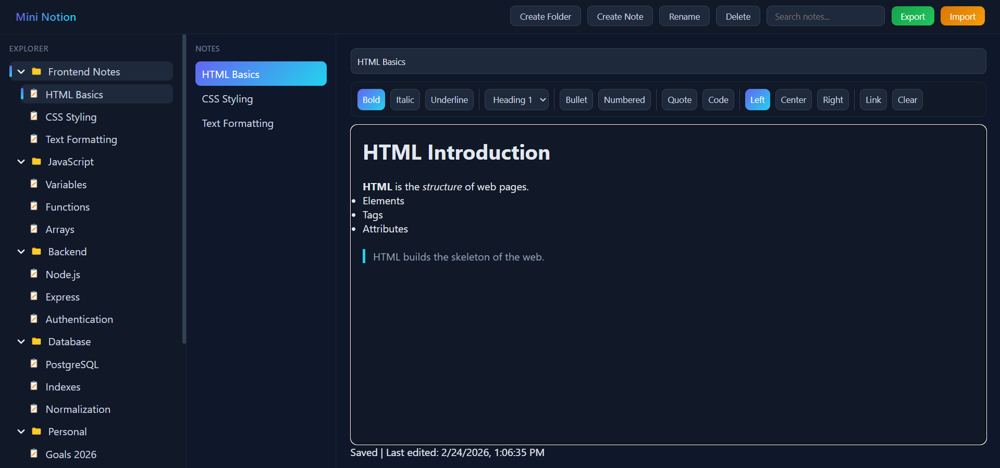
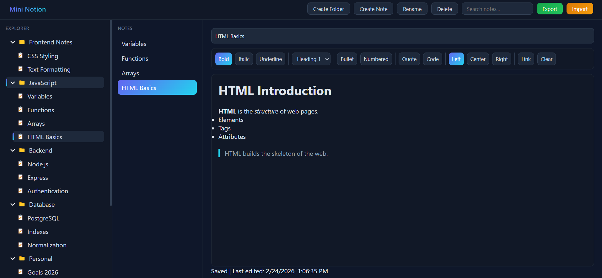
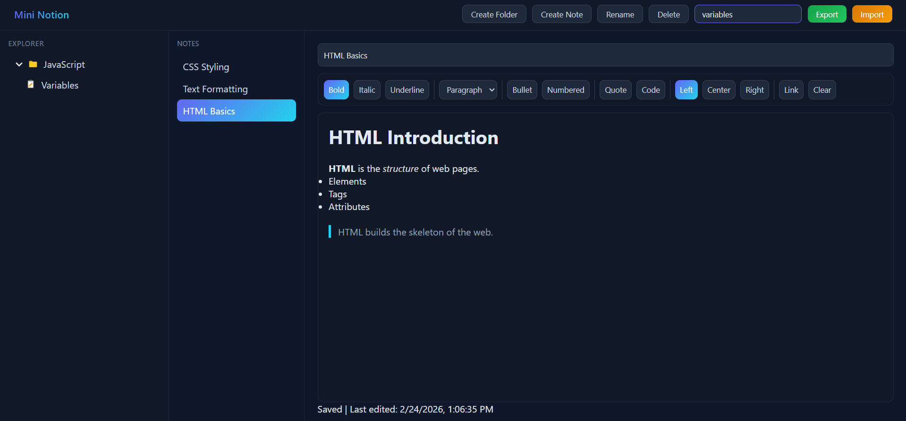
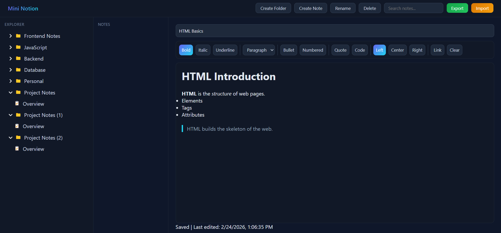
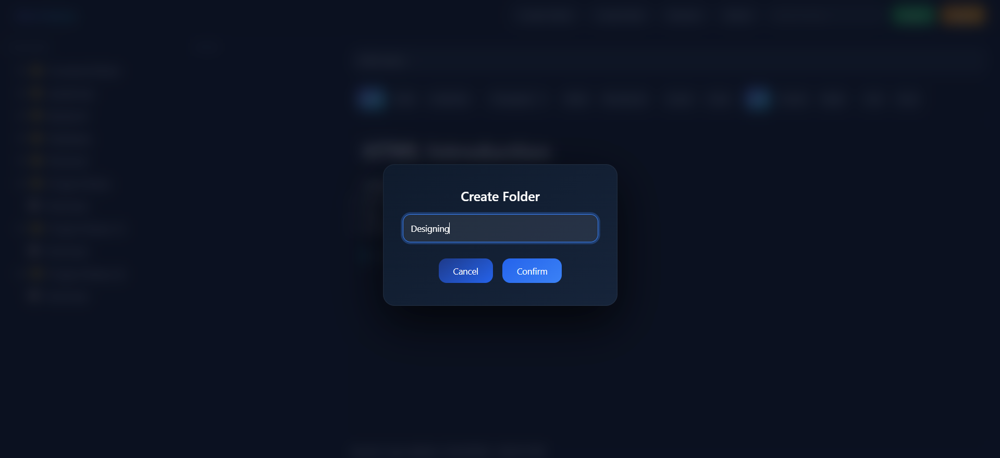
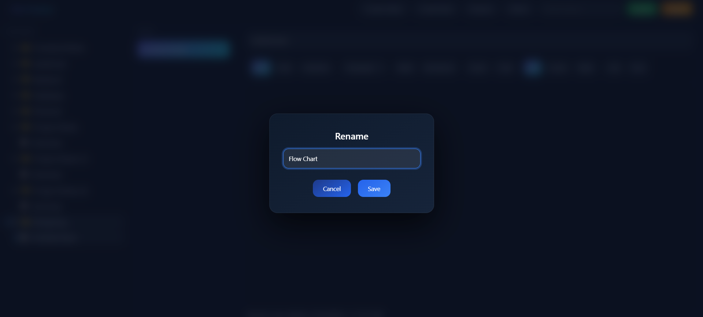
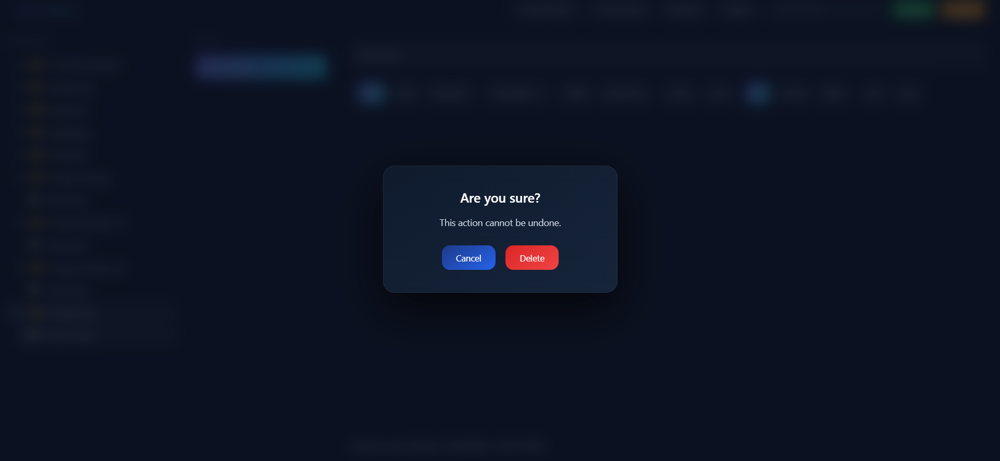

# Offline-First Personal Knowledge Base (Mini Notion)

A browser-based **Offline-First Personal Knowledge Base** built using **HTML, CSS, and Vanilla JavaScript**.

This project allows users to create, edit, and organize notes in a folder and sub-folder structure similar to a simplified version of Notion or a file explorer — with rich text editing, instant search, drag-and-drop organization, and automatic local persistence.

---

## Features

- Folder & Sub-folder hierarchy (tree view)
- Create, edit, rename, and delete notes
- Rich text editor (contenteditable)
- Automatic saving (localStorage)
- Instant search across all notes
- Last edited timestamps
- Drag-and-drop notes between folders
- Export data to JSON
- Import data from JSON
- Fully offline-first (no backend required)

---

## Screenshots

### Folder Tree & Layout

---

### Rich Text Editor

---

### Drag & Drop Organization

---

### Instant Search

---

## Import JSON Backup

---

## Create Folder and Note

---

## Rename Folder and Note

---

## Delete Folder and Note

---
